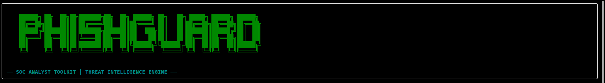
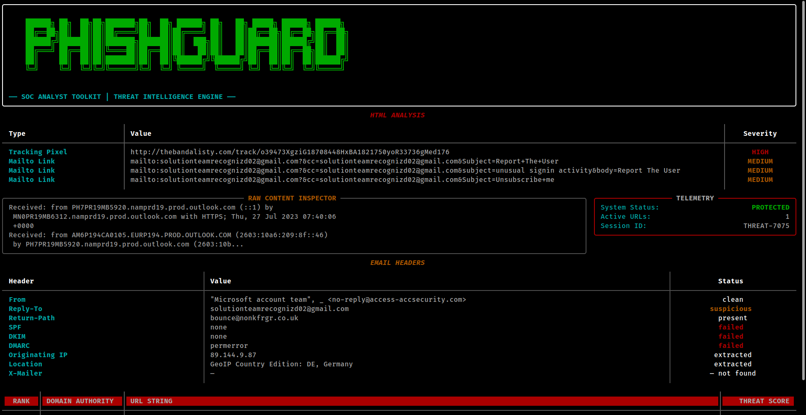

# 🛡️ PhishGuard: SOC Analyst Toolkit

PhishGuard is a high-performance, CLI-based SOC analyst toolkit designed to quickly analyze suspicious emails (`.eml` files) for phishing indicators, malicious URLs, and tracking pixels. It provides a comprehensive threat intelligence report with a sophisticated scoring engine.



## ✨ Features

-   **3D ASCII Interface:** A beautiful, high-detail terminal UI powered by `rich`.
-   **Email Header Analysis:** Automatically extracts and validates key headers:
    -   `From`, `Reply-To`, `Return-Path`.
    -   Authentication results: `SPF`, `DKIM`, `DMARC`.
    -   Originating IP extraction.
-   **HTML Deep Inspection:**
    -   **Tracking Pixel Detection:** Identifies hidden images used for tracking.
    -   **Mailto Link Analysis:** Flags suspicious mailto links often used in social engineering.
-   **URL Threat Intelligence:**
    -   Domain authority analysis using `tldextract`.
    -   Sophisticated **Threat Scoring Engine (0-100)** based on multiple risk factors.
    -   Risk categorization: `CLEAN`, `SUSPICIOUS`, `MALICIOUS`.
-   **Telemetry & Stats:** Real-time session tracking and analysis summary.

## 🚀 Installation

1.  **Clone the repository:**
    ```bash
    git clone https://github.com/m-uzayr-asif/phishguard.git
    cd phishguard
    ```

2.  **Set up a virtual environment (optional but recommended):**
    ```bash
    python3 -m venv venv
    source venv/bin/bin/activate  # On Linux/macOS
    ```

3.  **Install dependencies:**
    ```bash
    pip install -r requirements.txt
    ```

## 🛠️ Usage

Simply run the tool and point it to an `.eml` file:

```bash
python3 main.py samples/test.eml
```

### Example Output



## 📁 Project Structure

-   `main.py`: The primary entry point and UI controller.
-   `analyzers/`: Contains core analysis logic (URLs, HTML, Headers).
-   `utils/`: Utility functions for scoring and risk assessment.
-   `samples/`: Example email files for testing.
-   `images/`: Placeholders for documentation assets.

## 🛡️ Security Best Practices

This tool is designed for **initial triage**. Always follow your organization's security policies when handling suspicious files. Do not click on links or download attachments from untrusted sources.

---
*Developed as part of the SOC Analyst Toolkit | Threat Intelligence Engine*
